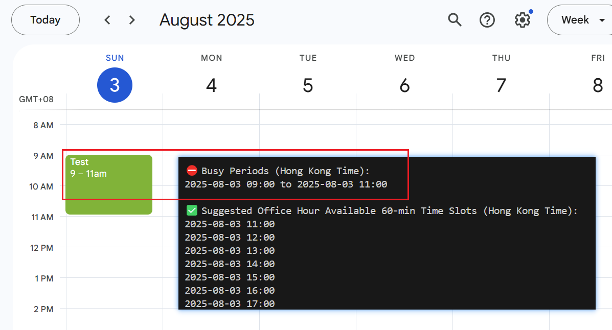
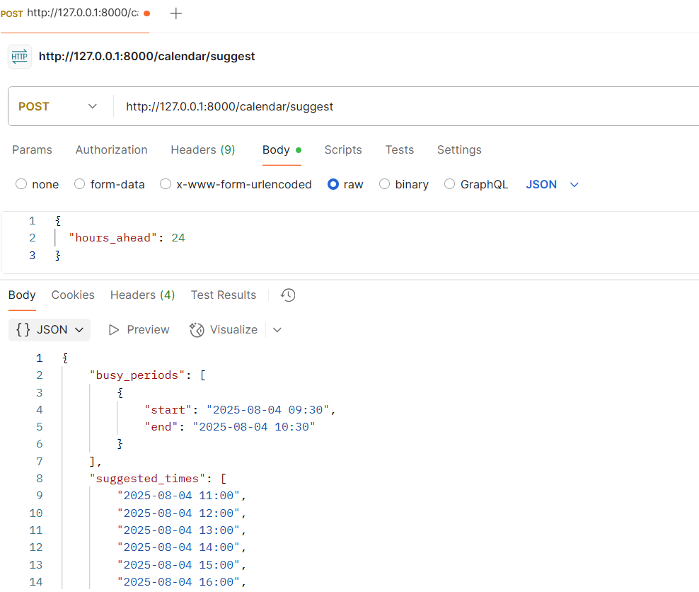

# Google Calendar Availability & Booking API (Python FastAPI POC)

This is a simple proof-of-concept project for integrating with the **Google Calendar API** using Python.

It includes:

- ✅ Authentication and calendar event reading  
- 🧠 Smart time slot suggestion (skip mornings, avoid lunch hours, etc.)  
- 📅 Event booking via FastAPI  
- 🔌 API endpoints for use in apps, bots, or scheduling tools  


## Requirements

### `requirements.txt`

Install dependencies via:

```bash
pip install -r requirements.txt
```


## Setup

### 1. Enable Google Calendar API

- Go to [Google Cloud Console](https://console.cloud.google.com/)
- Create a new project
- Navigate to: **APIs & Services > Library**
- Enable **Google Calendar API**

### 2. Create OAuth 2.0 Credentials

- Go to **APIs & Services > Credentials**
- Click **Create Credentials** > **OAuth client ID**
- If prompted:
  - Set the app type to **Desktop App**
  - Name it e.g., `Calendar POC`
- Download the `credentials.json` file and place it in your project root

> 📌 **IMPORTANT**: Add your Gmail to the **Test Users** section under **OAuth Consent Screen** to avoid `403: access_denied` error  
Go to **OAuth consent screen > Audience > Test users > Add your email**


### 3. How Authentication Works

- The first time you run a script, it opens a browser for you to sign in with Google
- If successful, a `token.pickle` file will be created to store access/refresh tokens
- On future runs, this token is reused, so you won’t need to re-authenticate

> 🔐 `token.pickle` = your personal access token, **do not commit to Git**


## Running the Scripts

### `calendar_availability.py` (CLI Script)

This script prints:
- Busy times from your primary calendar (based on your timezone)
- Suggest meeting slots only within business hours

#### Run it:

``` bash
python calendar_availability.py
```

#### Expected output:

``` bash
⛔ Busy Periods (Hong Kong Time):
2025-08-03 09:00 to 2025-08-03 11:00

✅ Suggested Office Hour Available 60-min Time Slots (Hong Kong Time):
2025-08-03 11:00
2025-08-03 12:00
2025-08-03 13:00
2025-08-03 14:00
2025-08-03 15:00
2025-08-03 16:00
2025-08-03 17:00
```



### `calendar_api.py` (FastAPI Server)
Same functionality as `calender_avalibility.py` only wrapped in FastAPI

#### Run it:

```bash
uvicorn calendar_api_poc:app --reload
```

#### API Endpoints:

##### `POST /calendar/suggest`

- Method: POST
- URL: http://127.0.0.1:8000/calendar/suggest
- Body (raw JSON):
```bash
{
  "hours_ahead": 24
}
```




## Notes

- This project is for personal/dev use only. For production apps, you’ll need to complete **OAuth app verification** with Google.
- Be careful with rate limits if calling the API frequently.
- Do not commit your `token.pickle` or `credentials.json` to public repositories.


## TODOs & Extensions

- Meeting booking endpoint that creates events directly in Google Calendar
- Add priority rules (e.g. prefer mornings or even slots)
- Integrate with Slack/WhatsApp bot for real-time booking
- More advance
  - Auto-generate Google Meet link
  - Add API key/auth for public deployment


## Credits

Built using:
- [FastAPI](https://fastapi.tiangolo.com/)
- [Google Calendar API](https://developers.google.com/calendar/api)
- [google-api-python-client](https://github.com/googleapis/google-api-python-client)

